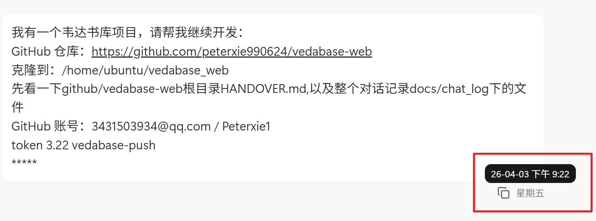

# 2026-04-03 对话记录

> **注意**：由于系统限制，部分会话的精确时间戳无法获取，已标注为“时间未知”。本日志严格遵循 HANDOVER.md 原则二生成。

## 会话 1 (2026-04-03 21:22)

**用户**:
我有一个韦达书库项目，请帮我继续开发：
GitHub 仓库：https://github.com/peterxie990624/vedabase-web
克隆到：/home/ubuntu/vedabase_web
先看一下github/vedabase-web根目录HANDOVER.md,以及整个对话记录docs/chat_log下的文件
GitHub 账号：3431503934@qq.com / Peterxie1
token 3.22 vedabase-push
*****

**Manus**:
> **摘要**：初始化项目，读取交接文档，开始重构目录布局。
>
> **操作步骤**：
> 1. 克隆 GitHub 仓库并安装依赖。
> 2. 读取 `HANDOVER.md` 了解项目背景和开发原则。
> 3. 分析 `SBTableOfContents.tsx` 组件结构。
> 4. 根据用户需求（目录页面UI布局偏好）重构目录布局，移除顶部 sticky 浮动块，扩大红色块（目录头），在红色块底部添加篇/章。

---

## 会话 2 (时间未知)

**用户**:
对

**Manus**:
> **摘要**：继续重构目录样式。
>
> **操作步骤**：
> 1. 调整目录标题字体大小和内边距。
> 2. 增加篇/章块的内边距，调整颜色和边框。
> 3. 提交代码并推送至 GitHub。

---

## 会话 3 (时间未知)

**用户**:
这意味着篇块应该在当前篇超过目录（也就是目录容器的顶部，两个红色块下面的块，可能不是这个篇的直接父级，我只是这样叫方便）的顶部被超过时显示

**Manus**:
> **摘要**：优化置顶判断逻辑。
>
> **操作步骤**：
> 1. 修改判断逻辑：当篇/章超出目录容器顶部时才显示对应的浮动块。
> 2. 修复判断逻辑中 `containerRect.top` 作为边界的计算。
> 3. 提交代码：`refactor: 优化篇/章置顶判断逻辑`。

---

## 会话 4 (时间未知)

**用户**:
不是大小
布局排列

**Manus**:
> **摘要**：对比并统一 SB 和 BG 的目录样式。
>
> **操作步骤**：
> 1. 分析 `BGReadPage.tsx` 和 `SBReadPage.tsx` 的样式差异。
> 2. 提取 `SBTableOfContents` 为独立组件，以便在两个页面中复用。
> 3. 修复 `BGReadPage` 目录没有展开/收起功能的问题。
